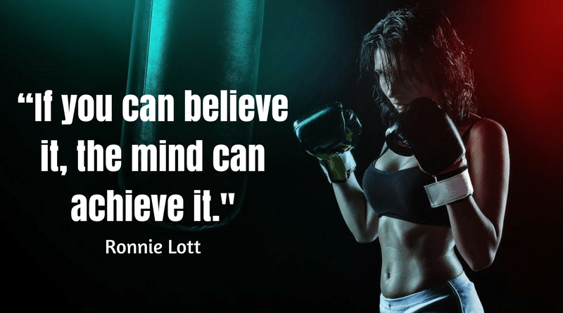
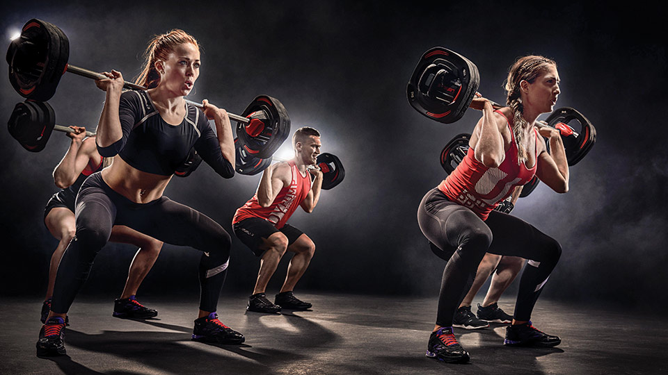
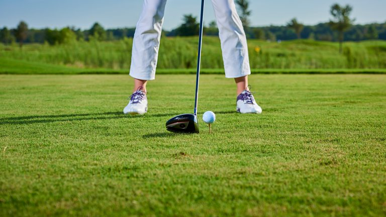

<!DOCTYPE html>
<!--
To change this license header, choose License Headers in Project Properties.
To change this template file, choose Tools | Templates
and open the template in the editor.-->
<html>
    <head>

        <link rel="stylesheet" href="newcss.css" type="text/css"/>

        <title>TODO supply a title</title>
        <meta charset="UTF-8">
        <meta name="viewport" content="width=device-width, initial-scale=1.0">
        
    </head>
    <body>
          

            <h1>TRAINING 4U</h1>
            
Welcome to Training 4U. 
                We are providing you sports lessons with affordable price.

        

       <!-- Navigation -->

  <a href="index.md">Home</a>
  <a href="sport.md">Sport</a>
  <a href="lesson.md">Lesson</a>
  <a href="booking.md">Booking Lesson</a>
  <a href="#" class="right">About Us</a>

       

           

               <h3>"Sport has the power to change the world. It has the power to inspire, it has the power to unite people in a way that little else does. It speaks to youth in a language they understand. Sport can create hope, where once there was only despair. It is more powerful than governments in breaking down racial barriers. It laughs in the face of all types of discrimination."– Nelson Mandela</h3>
               
           

  

<h1>Training Sports</h1>

<!-- Portfolio Gallery Grid -->

  

    

      
      <h3>Zumba</h3>
      
Dance to great music, with great people, and burn a ton of calories without even realizing it.

      <a href="sport.xhtml">view</a>
    

  

  

    

      
      <h3>Bodypump</h3>
      
Get lean, build strength and tone muscle with BODYPUMP

      <a href="sport.xhtml">view</a>
    

  

  

    

      
      <h3>Golf</h3>
      
Learn golf from the best.

      <a href="sport.xhtml">view</a>
    

  

  

    

      
      <h3>Tennis</h3>
      
Experience world-class tennis lessons

      <a href="sport.xhtml">view</a>
    

  

  
  <h3>Yoga</h3>
  
Bringing insight and world best yoga practitioners with the most heartiness form of yoga.

  <a href="sport.xhtml">view</a>

<!-- END MAIN -->

</body>
</html>
